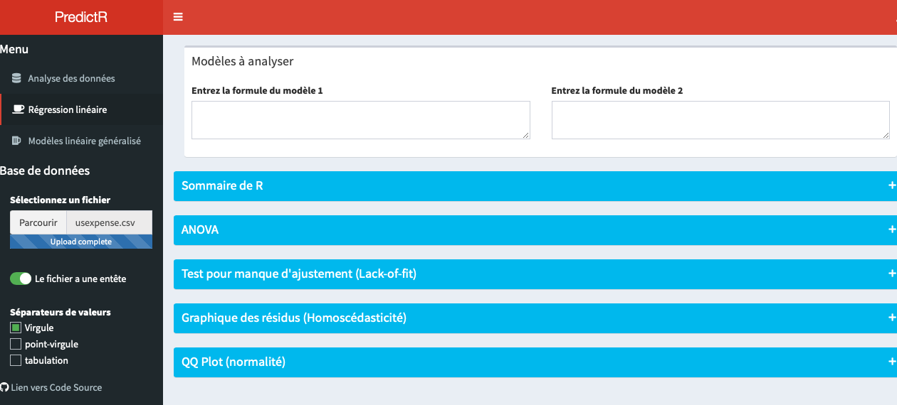
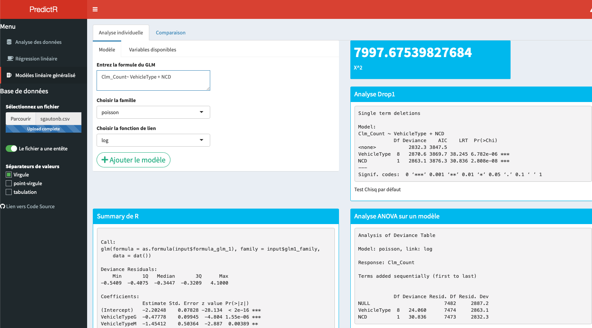

# predictR
A friendly shiny app UI to help you create linear models on your data

## How to use
If you want a demo before cloning/forking the repo, go to
> https://gabrielcrepeault.shinyapps.io/predictR/

## What it can do
* **Data analysis** : helps you visualize (plot, table, `R summary()` output) your data before creating your linear model.
* **Linear regression** : You can compare metrics on two models at the same time : 
  

* **General linear models** : Write your `R glm()` formula while getting couple of useful metrics on the current model : 
  
  

## What it can't do
* Lasso
* Ridge
* Cross-Validation
* Box-Cox
* Deal with large datasets (it's suggested to stay under 300Mb, depending of your internet connection)
  
